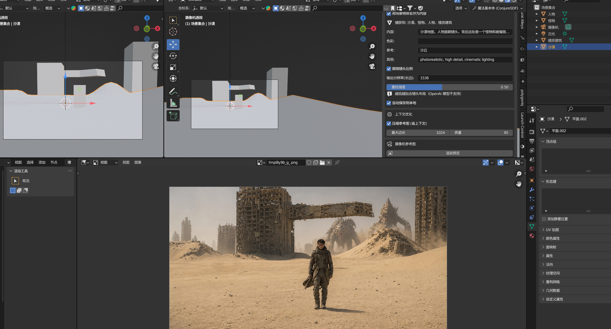

# 摄像机视图 AI 渲染图生成器

> Blender 插件 —— 渲染摄像机视图作为参考底图，调用 AI API 生成一张高质量图片，显示在图像编辑器



**左上：Blender 场景（简陋的 3D 方块）→ 右侧面板填提示词 → 底部：AI 生成的电影级沙丘废墟场景**

---

## 功能特性

### 核心流程

```
3D 场景摆好镜头构图 → 渲染摄像机视图作为参考底图 → 调用 AI 图生图 API → 生成图片自动保存并显示
```

### 15 项功能

| # | 功能 | 说明 |
|---|------|------|
| 1 | **自动渲染参考底图** | 一键渲染摄像机视图，自动备份/还原渲染设置 |
| 2 | **按物体名称定向生成** | 自动收集场景网格物体名，作为 AI 生成主体（"把每个物体渲染成其名称对应的真实物品"） |
| 3 | **自定义提示词面板** | 内容 / 色彩 / 参考 / 其他 四维提示词，灵活控制生成风格 |
| 4 | **跟随镜头比例输出** | 输出图片比例自动匹配摄像机分辨率（16:9 镜头 → 输出也是宽屏），保证构图一致 |
| 5 | **重绘强度可调** | 越低越保留镜头布局（0.2≈几乎不变，1.0=大幅重绘） |
| 6 | **双平台兼容** | 本地 SD WebUI + 云雾AI(fal-ai 中转) |
| 7 | **动态模型列表** | 填网站 + Token → 自动拉取可用模型列表（默认过滤 GPT/Google 图像模型） |
| 8 | **多协议自动适配** | SD WebUI 协议 / fal-ai JSON / OpenAI multipart 三种协议自动判断 |
| 9 | **上下文优化** | 参考图自动缩放+转 JPEG（体积降 5-8 倍），降低 API 消耗与费用 |
| 10 | **全参数可控** | 分辨率、重绘强度、JPEG 质量、压缩开关等均可调节 |
| 11 | **自动保存本地** | 生成的图片自动保存到 `~/AI_Generated_Images/`（带时间戳命名） |
| 12 | **实时状态反馈** | 进度条显示当前步骤（渲染/压缩/调用API/成功/失败详情） |
| 13 | **失败诊断** | 中文错误提示（地址格式/网络/鉴权/格式异常），可复制错误信息 |
| 14 | **异步执行** | 后台线程处理 API 调用，不卡 Blender 界面 |
| 15 | **图像编辑器直显** | 生成后自动在 Blender 图像编辑器中打开 |

### 支持的平台与模型

| 平台 | 说明 | 推荐模型 |
|------|------|----------|
| **本地 SD WebUI** | Stable Diffusion WebUI (127.0.0.1:7860) | 任意已安装模型 |
| **云雾AI 中转站** | fal-ai 兼容转发站 | Wan 2.2 / Flux Dev / SD3 / gpt-image-2 等 |
| **OpenAI 兼容** | 标准 OpenAI Images Edit API | gpt-image-2 |

## 安装方法

1. 将 `view_to_object_ai.py` 放入 Blender 插件目录：
   - Windows: `%APPDATA%\Blender Foundation\Blender\X.X\scripts\addons\`
   - 或直接在 Blender 中：`编辑 → 首选项 → 插件 → 安装...` 选择此文件
2. 在插件列表中勾选「**摄像机视图 AI 渲染图生成器**」启用
3. 打开 **3D 视图**，按 `N` 键打开侧边栏，找到 **AI生成** 分类

## 使用指南

### 快速上手（3 步）

1. **配置 API**
   - 选择平台（本地SD WebUI 或 云雾AI）
   - 云雾AI：填写网站地址 + Token
   - 点击 **获取模型列表** → 选择一个图像生成模型
   - （可选）切换过滤器：全部 / 仅 GPT & Google 图像模型

2. **设置提示词与参数**
   - ☑ 开启「**用场景物体名作为内容**」（推荐）—— 自动捕获场景里的模型名
   - 填写内容/色彩/参考/其他描述词
   - 调整分辨率和重绘强度（保布局建议 ≤0.35）

3. **点击「▶ 生成图片」**
   - 等待进度条走完（约 10-60 秒取决于模型和网络）
   - 图片自动显示在图像编辑器 + 保存到 `~/AI_Generated_Images/`
   - 失败时查看底部「失败详情」面板获取中文错误原因

### 参数详解

#### 自定义提示词

| 字段 | 默认值 | 用途 |
|------|--------|------|
| **内容** | *(空)* | 画面主体描述（如"游戏机漂浮在水面上"） |
| **色彩** | *(空)* | 色调氛围（如"沙丘日"、"赛博朋克霓虹蓝"） |
| **参考** | *(空)* | 风格参照物（如"电影《沙丘》风格"、"宫崎骏画风"） |
| **其他** | photorealistic, high detail, cinematic lighting | 画质/构图补充 |

#### 输出控制

| 参数 | 默认值 | 范围 | 说明 |
|------|--------|------|------|
| **跟随镜头比例** | ✅ 开启 | — | 输出比例匹配摄像机分辨率 |
| **输出分辨率(长边)** | 1536 | 256–2048 | 最大边的像素数 |
| **重绘强度** | 0.50 | 0.10–1.00 | 越低越贴合原布局；⚠️ OpenAI 不支持 |
| **压缩参考图** | ✅ 开启 | — | 缩放+转 JPEG 降低 API 消耗 |
| **参考图最大边长** | 1024 | 0–2048 | 0 = 不缩放 |
| **JPEG 质量** | 85 | 10–100 | 越低文件越小但质量下降 |

## 技术架构

```
┌─────────────────────────────────────────────┐
│              Blender 主线程                   │
│                                               │
│  Operator.execute()                           │
│    ├─ render_camera_view_to_temp()            │
│    ├─ 计算镜头比例 → computed_size            │
│    ├─ 收集场景物体名 → scene_object_names      │
│    └─ GenerationWorker.start()                │
│                                               │
│  Modal Timer (100ms)                          │
│    └─ Queue ← Worker 结果                     │
│       ├─ progress → 进度条更新               │
│       ├─ success → 显示图片 + 保存           │
│       └─ error   → 失败详情面板              │
└──────────────────┬──────────────────────────┘
                   │ queue
┌──────────────────▼──────────────────────────┐
│         GenerationWorker (线程)               │
│                                               │
│  _build_prompt()                              │
│  prepare_reference_image() [压缩优化]        │
│  call_api()                                  │
│    ├─ _detect_protocol() → sd/fal/openai     │
│    ├─ _call_sd_webui()                       │
│    ├─ _call_fal()                            │
│    └─ _call_openai_image_edit()             │
│  _parse_image_response()                     │
│  save_generated_image() [自动保存]          │
└─────────────────────────────────────────────┘
```

### 关键技术决策

- **线程安全**：所有 API/IO 操作在 worker 线程完成，材质/UI 操作只在主线程 modal 回调中执行（Blender RNA 不是线程安全的）
- **协议分发**：`_detect_protocol()` 根据 URL 和 model_id 自动选择协议——fal-ai 用 JSON body (`image_url`)、OpenAI 用 multipart/form-data、SD WebUI 用标准 img2img
- **参考图压缩**：发送前缩放到目标长边 + JPEG q85 编码，PNG 400-800KB → JPEG 60-120KB（降 5-8 倍）
- **HTML 响应检测**：URL 错误时 fal 转发站返回网站首页 HTML，需明确提示用户检查地址

## 版本历史

| 版本 | 日期 | 更新 |
|------|------|------|
| **v4.5.0** | 2026-07-19 | 新增「用场景物体名作为内容」命名驱动生成 |
| v4.4.0 | 2026-07-19 | 跟随镜头比例输出 + 重绘强度滑块 |
| v4.3.0 | 2026-07-19 | 提示词面板改为内容/色彩/参考/其他四维结构 |
| v4.2.0 | 2026-07-19 | 参考图自动压缩优化（降低 API 上下文消耗） |
| v4.1.0 | 2026-07-18 | 纯渲染图生成器（不修改场景，不映射材质） |
| v4.0.0 | 2026-07-18 | 删参数精简版（删重绘幅度/采样步数/CFG，单图共享材质） |
| v3.0.0 | 2026-07-17 | 按功能文档重写，精简到 920 行 |

## 许可证

MIT License

## 作者

morningddy ([@morningddy](https://github.com/morningddy))
